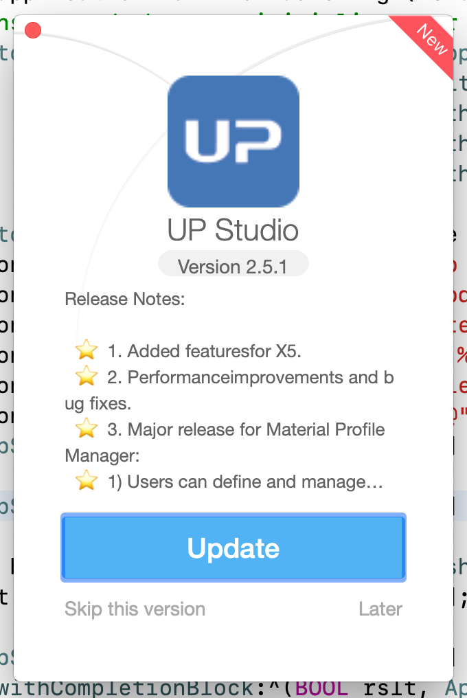
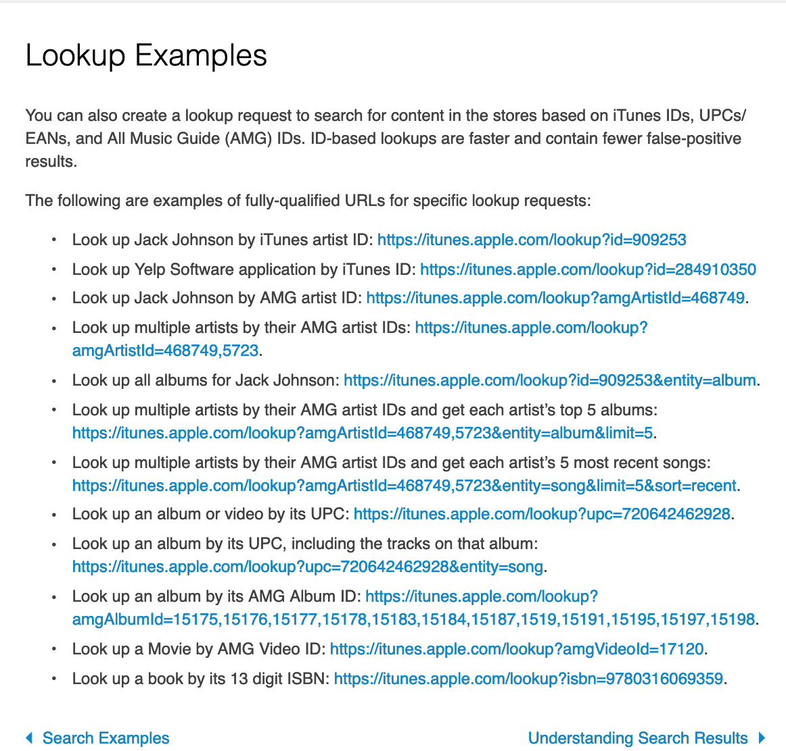

##### AppStoreUpdateKit是一个方便开发者从Mac App Store进行更新检查的组件。



## 如何安装
克隆仓库到本地，将AppStoreUpdateKit工程加入到你的项目。

## 功能
- [x] 根据你的需要进行自定义。
- [x] 检查Mac App Store的更新。
- [x] 非常好看的UI来请求用户进行更新或者跳过更新。

## 栗子

在工程文件里，编译执行'AppStoreUpdateKitDemo'这个目标程序，方可见demo.
## 参考文档

https://developer.apple.com/library/archive/documentation/AudioVideo/Conceptual/iTuneSearchAPI/LookupExamples.html



## 如何使用
- 检查新版本是否可用

```
#import <AppStoreUpdateKit/AppStoreUpdateKit.h>

//Create an app object with your app info. (the productID is important, find the productID on itunes website, eg: https://itunes.apple.com/us/app/kaka/id1434172933?mt=12)

    AppStoreUpdateAppObject *appObj = [[AppStoreUpdateAppObject alloc] initWithAppName:@"Kaka"
                                                                           withAppIcon:[NSImage imageNamed:@"cat"]
                                                                    withCurrentVersion:@"1.0.9"
                                                                         withProductID:@"1434172933"];
//Synchronize to check app update.
    //rslt will be YES if getting app info is successful.
    BOOL rslt =[[AppStoreUpdateManager sharedManager] checkAppUpdate:appObj];
    //Check if new version is available.
    rslt = [appObj isNewVersionAvailable]
    
//Asynchronize to check app update.
    [[AppStoreUpdateManager sharedManager] checkAppUpdateAsync:appObj withCompletionBlock:^(BOOL rslt, AppStoreUpdateAppObject * _Nonnull AppObj) {
        //rslt will be YES if getting app info is successful.
        
        //Check if new version is available.
        rslt = [AppObj isNewVersionAvailable]
        
        //Your code here
    }];

```

- 定制更新提示窗口

```
    //创建一个配置UI对象并且设定对应的值
AppStoreUpdateUIConfigure *UIConfigure = [[AppStoreUpdateUIConfigure alloc] init];
    [UIConfigure setSkipButtonTitle:@"跳过"];
    [UIConfigure setUpdateButtonTitle:@"更新"];
    [UIConfigure setLaterButtonTitle:@"稍后"];
    [UIConfigure setVersionText:@"版本 %@"];
    [UIConfigure setReleaseNotesText:@"更新说明:\n\n"];
    [UIConfigure setReleaseNotesNoneText:@"更新说明:\n\n 无"];
    
    //将UI配置对象传递给AppStoreUpdateManager
    [[AppStoreUpdateManager sharedManager] customize:UIConfigure];
```

- 设置返回文案的语言

```
 //Only in Chinese and English, other can supplement
 [[AppStoreUpdateManager sharedManager] isInternationalAddress:YES];

-(void)isInternationalAddress:(BOOL)bInter
{
    if(bInter)
    {
        strRequest = @"https://itunes.apple.com/lookup?id=";
    }else
    {
        strRequest = @"https://itunes.apple.com/cn/lookup?id=";
    }
}
```

- 跳过当前版本

```

//Check if the current new version has been skipped 
    [[AppStoreUpdateManager sharedManager] isCurrentNewVersionSkipped:appObj]
    
//Skip the current new version
    [[AppStoreUpdateManager sharedManager] skipCurrentNewVersion:AppObj];
      
```

- 请求升级提示窗口并处理用户的返回结果

```
//This method MUST be invoked in the main thread!!
    [[AppStoreUpdateManager sharedManager] requestAppUpdateWindow:appObj withCompletionCallback:^(AppUpdateWindowResult rslt, AppStoreUpdateAppObject * _Nonnull AppObj) {
                    switch (rslt) {
                        case AppUpdateWindowResultUpdate:
                            [[NSWorkspace sharedWorkspace] openURL:[NSURL URLWithString:[NSString stringWithFormat:@"macappstore://itunes.apple.com/app/id%@",[AppObj productID]]]];
                            break;
                            
                        case AppUpdateWindowResultSkip:
                            [[AppStoreUpdateManager sharedManager] skipCurrentNewVersion:AppObj];
                            break;
                            
                        case AppUpdateWindowResultLater:
                            break;
                            
                        default:
                            break;
                    }
                }];

```


